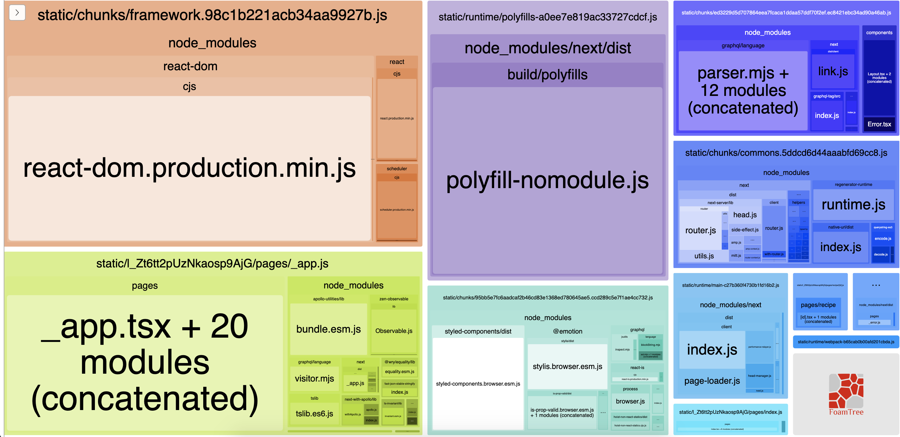

# M&S Recipes

This is recipes project to show an approach to integrate Next, Apollo, and Contentful.

The project is a Next app that gets Contentful data using Apollo and GraphQL queries. 
The project has two pages:

- Homepage: shows a list of recipes
- Recipe detail: Each recipe detail page

## Getting Started

Please check your node version:
```bash
node -v
```
First, install the dependencies:

```bash
yarn install
```

### Installing

####**How to add the __environment variables__:**

First create a local env file:
```bash
cd <project-root> folder
touch .env.local
```
Open .env.local file and add these environment variables and 
their corresponding values:
```bash
CONTENTFUL_ACCESS_TOKEN=
CONTENTFUL_ENVIRONMENT=
CONTENTFUL_SPACE_ID=
```

then run the project
```bash
yarn dev
```

Open [http://localhost:3000](http://localhost:3000) with your browser to see the result.
Make sure 3000 port is available and your page is accessible.


## Built With

* [NextJS](https://nextjs.org/docs/getting-started) - The web framework used.
* [ReactJS](https://reactjs.org/docs/getting-started.html) - The library used to build the website
* [Yarn](https://classic.yarnpkg.com/en/docs) - Dependency Management with Yarn
* [Styled-Components](https://styled-components.com/docs) - CSS Styled-Component to create beautiful pages
* [Apollo](https://www.apollographql.com/docs/) - Data Fetching with Apollo GraphQL Client
* [Contentful](https://www.contentful.com/developers/docs/) - Contentful API reference
## Repository referenced to create Boilerplate

*[NextJS Official Repository Examples](https://github.com/vercel/next.js/blob/canary/examples/) - Thanks to everyone who contributed to this project.

## Analyze




## Contributing

Not available right now. ;)

## TechDebt

- Create Global Stylesheet for better optimisation.
- UI Improvements


## Authors

* **Paresh Salunke** -  [Github Profile](https://github.com/pareshsalunke)

## License

This project is licensed under the MIT License - see the [LICENSE.md](LICENSE.md) file for details

## Acknowledgments

* Hat tip to anyone whose code was used
* Inspiration
* etc
# ms-recipes
